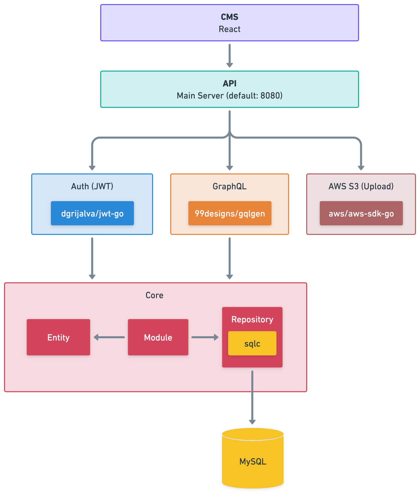
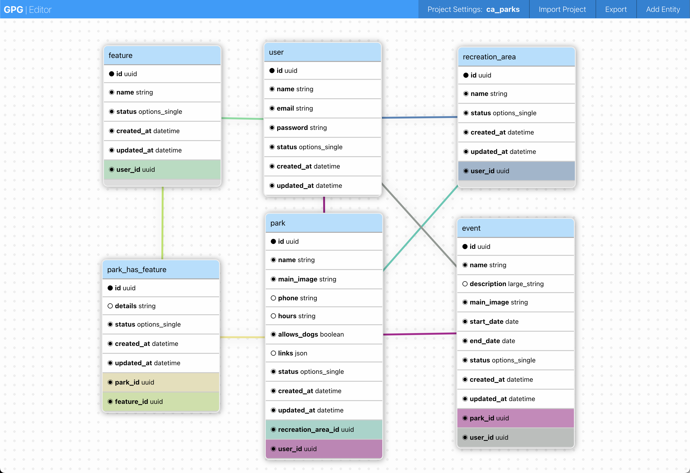
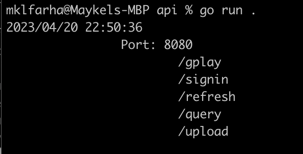

# GPG
Go Project Generator

GPG is a tool to generate a GraphQL API, Auth Server (JWT) and Web Management Tool (React) based on a configuration file that defines entities with their corresponding fields and relationships written in Go.

This code is experimental and is not meant for production usage, use it at your own risk

## What you get from the generator


You are generating a layered monolith, it includes an auth server, a GraphQL API (playground included), and a web CMS to manage your data.

The generator will take care of creating the code and the tables in MySQL and it will make the corresponding changes as your design evolves by leveraging [Skeema](https://github.com/skeema/skeema) and GO templates.

This generator is great for small projects, prototyping, and capturing structured data, you can have the project up and running in a few minutes.

## Getting Started 

### Step 1 - Model your project

GPG takes in a JSON file that holds the configuration of the project, a list of the entities, with the corresponding fields and relationships. 

You can generate this config file using the [GPG Web Editor](https://gpg.maykelfarha.com/).



- Make sure to include a user entity in your design this is needed for authentication and to access the web app.
- Follow the naming conventions to avoid unusual errors.

### Step 2 - Setup your database

GPG currently only supports MySQL, make sure you have MySQL running locally or in the cloud and update the configuration in the project settings.

### Step 3 - Generate the code

Make sure you have Go installed (last tested in 1.18)

Clone this repo:
```
git clone git@github.com:mklfarha/gpg.git
```

Build the code:
```
go build .
```

Run the generator with your config file and target (where you want the code to be generated):
```
go run . genall ./gpg_project_ca_parks_1682056073188.json ~/Desktop/caparks
``` 

### Step 4 - Validate the generation 

The code will log every step of the generation, this can be the first step to ensure everything was generated correctly.

Check MySQL and make sure your tables have been generated, there should be a table for each of your entities:
```
SHOW TABLES
```

Try building and running the generated code:

```
cd {generate target path}/{project identifer}/api

go build .

go run .
```

This should run your API locally, you should see something like this




### Step 5 - Create a user 

### Step 6 - Run the CMS 

### [Bonus] Generate an token and use the GraphQL Playground


