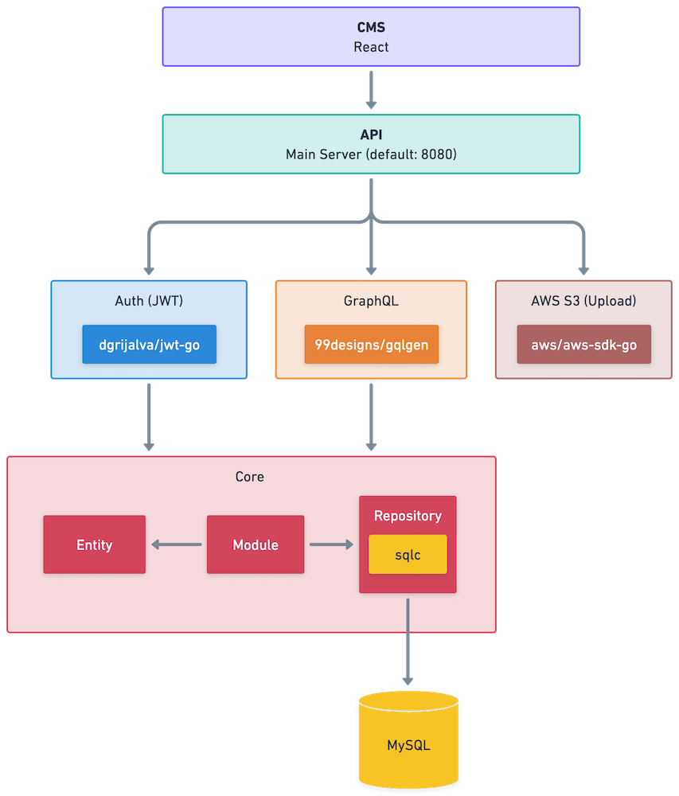

** This code is experimental and is not meant for production usage, use it at your own risk. **

# GPG
Go Project Generator

GPG is a tool to generate a GraphQL API, Auth Server (JWT) and Web Management Tool (React) based on a configuration file that defines entities with their corresponding fields and relationships written in Go.

## What you get from the generator

