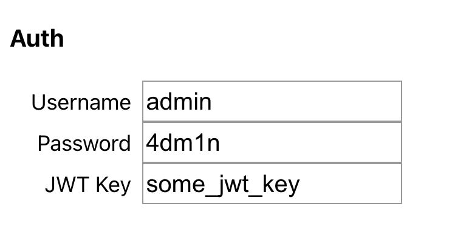
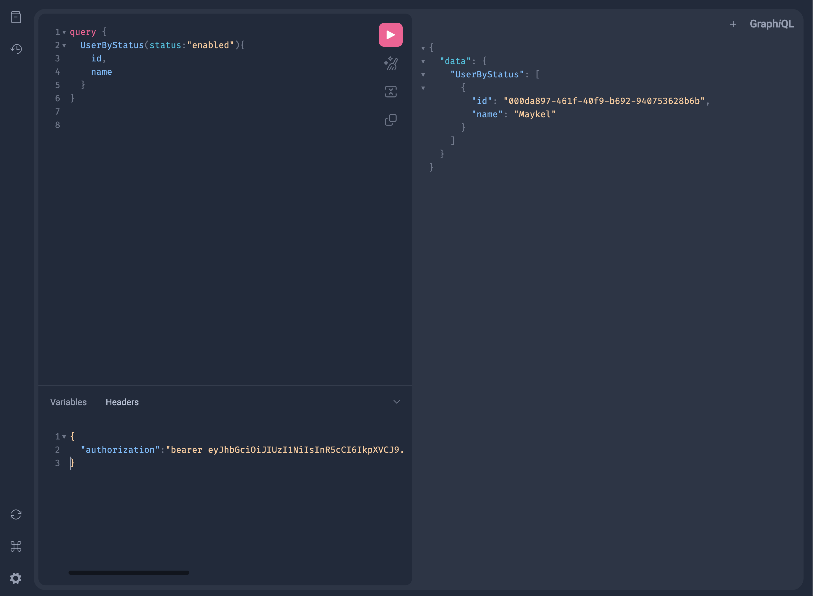

# GPG
Go Project Generator

GPG is a tool to generate an API based on a configuration file that defines entities with their corresponding fields and relationships written in Go.

This code is experimental and is not meant for production usage; use it at your own risk.

## What you get from the generator


You are generating a layered monolith, it includes an auth server (optional), a GraphQL API (playground included), and a web CMS to manage your data (optional).

The generator will create the code and the tables in MySQL and make the corresponding changes as your design evolves by leveraging [Skeema](https://github.com/skeema/skeema) and GO templates.

This generator is great for small projects, prototyping, and capturing structured data; you can have the project up and running in a few minutes.

Check out the [CA Parks demo project](https://github.com/mklfarha/gpg-demo-ca-parks) for the generated code.

## Getting Started 

### Step 1 - Model your project

GPG takes in a [JSON file](https://github.com/mklfarha/gpg-demo-ca-parks/blob/master/gpg_project_ca_parks_config.json) that holds the configuration of the project, a list of the entities, with the corresponding fields and relationships. 

You can generate this config file using the [GPG Web Editor](https://gpg.maykelfarha.com/).


- Make sure to include a user entity in your design this is needed for authentication and to access the web app.
    - The email and password fields are required 
- Follow the naming conventions to avoid unusual errors.

### Step 2 - Setup your database

GPG currently only supports MySQL; make sure you have MySQL running locally or in the cloud and update the configuration in the project settings.

### Step 3 - Generate the code

Make sure you have Go installed (last tested in 1.18)

Clone this repo:
```
git clone git@github.com:mklfarha/gpg.git
```

Build the code:
```
go build .
```

Run the generator with your config file and target (where you want the code to be generated):
```
go run . genall ./gpg_project_ca_parks_1682056073188.json ~/Desktop/caparks
``` 

### Step 4 - Validate the generation 

The code will log every step of the generation, this can be the first step to ensure everything was generated correctly.

Check MySQL and make sure your tables have been generated, there should be a table for each of your entities:
```
SHOW TABLES
```

Try building and running the generated code:

```
cd {generate target path}/{project identifer}/api

go build .

go run .
```

This should run your API locally; you should see something like this.


### Step 5 - Create a user 

You can use the CLI tool in the generated code to create the first user. Afterwards, you can use the CMS.

To use the CLI, follow these steps:

```
cd {generate target path}/{project identifer}/cli

go build .

go run . create-user
```

Follow the interactive steps to create the user.

### Step 6 - Run the CMS 

The CMS web tool uses React; make sure you have node installed

Follow these steps to run it:

```
cd {generate target path}/{project identifer}/web

npm install

npm start
```

The web app should start on port 3000 


### [Bonus] Generate a token and use the GraphQL Playground

To generate a token, you need to create a user first 

You can use the CLI tool in the generated code to create a user token,

To use the CLI, follow these steps:

```
cd {generate target path}/{project identifer}/cli

go build .

go run . create-token
```

Follow the interactive steps to create the token.

Once you have the token, open the playground

```
http://localhost:8080/gplay 
```

Enter the username and password added in the project settings:



(if prompted again, cancel; at this point, you should see the playground)

Add the token generate in the headers and reload

```
{
  "authorization":"bearer {your token here}"
}
```



